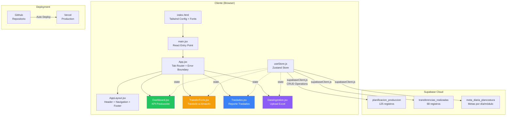
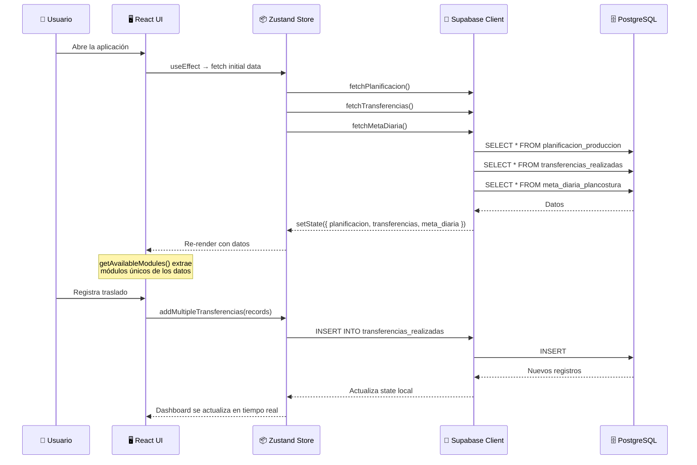
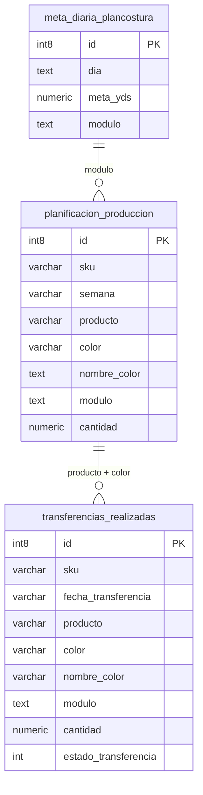
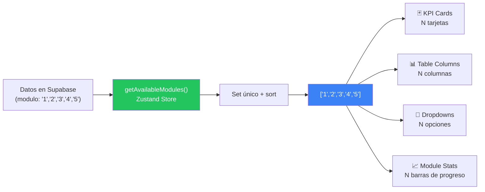
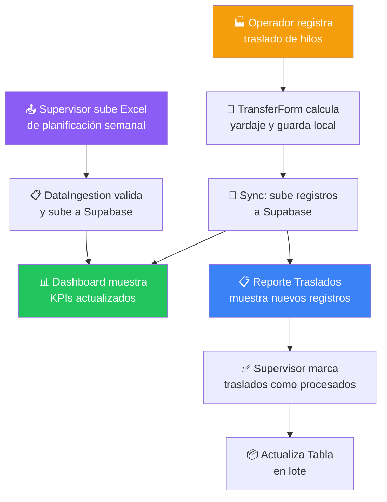

<p align="center">
  
</p>

<h1 align="center">INTERMODA — Sistema de Control de Producción</h1>

<p align="center">
  <strong>Plataforma de monitoreo en tiempo real para la gestión de hilazas, traslados y KPIs de producción textil</strong>
</p>

<p align="center">
  
  
  
  
  
  
  
</p>

---

## 📋 Tabla de Contenidos

- [Descripción General](#-descripción-general)
- [Características Principales](#-características-principales)
- [Stack Tecnológico](#-stack-tecnológico)
- [Arquitectura del Sistema](#-arquitectura-del-sistema)
- [Estructura del Proyecto](#-estructura-del-proyecto)
- [Modelo de Datos (Supabase)](#-modelo-de-datos-supabase)
- [Módulos de la Aplicación](#-módulos-de-la-aplicación)
- [Sistema de Módulos Dinámicos](#-sistema-de-módulos-dinámicos)
- [Instalación y Configuración](#-instalación-y-configuración)
- [Variables de Entorno](#-variables-de-entorno)
- [Despliegue](#-despliegue)
- [Flujo de Trabajo del Usuario](#-flujo-de-trabajo-del-usuario)
- [Recomendaciones Técnicas](#-recomendaciones-técnicas)
- [Licencia](#-licencia)

---

## 🏭 Descripción General

**Intermoda Monitor** es una aplicación web de uso interno desarrollada para **Intermoda S.A.**, una empresa de manufactura textil. El sistema permite el **seguimiento en tiempo real de la producción de hilazas**, el control de traslados entre almacenes, y la visualización de KPIs de cumplimiento por módulo de producción.

La plataforma fue diseñada para ser operada por personal de planta y supervisores de producción, proporcionando una interfaz clara y responsive que funciona tanto en escritorio como en dispositivos móviles (PWA-ready).

### ¿Qué problema resuelve?

| Antes | Ahora |
|-------|-------|
| Seguimiento manual en hojas de Excel | Dashboard en tiempo real con datos de Supabase |
| Sin visibilidad del % de cumplimiento | KPIs instantáneos por módulo con código de color |
| Traslados registrados en papel | Formulario digital con sync a base de datos |
| Datos fragmentados entre departamentos | Una sola fuente de verdad accesible desde cualquier dispositivo |

---

## ✨ Características Principales

- 📊 **Dashboard KPI en tiempo real** — Tarjetas de cumplimiento por módulo con indicadores de color (verde/amarillo/rojo)
- 📈 **Meta diaria por módulo** — Resumen Lunes-Viernes de cumplimiento vs. meta configurada en Supabase
- 📦 **Registro de traslados** — Formulario para documentar transferencias de hilos entre almacenes con cálculo automático de yardaje
- 📋 **Reporte de traslados** — Tabla interactiva con filtros, estado procesado/pendiente, y actualización en lote
- 📤 **Ingesta de datos (Excel)** — Carga masiva de planificación desde archivos `.xlsx`, `.xls`, o `.csv` con validación previa
- 🔄 **Módulos dinámicos** — El sistema detecta automáticamente módulos nuevos (4, 5, N...) sin necesidad de cambios de código
- 📱 **PWA-ready** — Configuración de Progressive Web App para instalación en dispositivos móviles
- 🎨 **Material Design 3** — Paleta de colores basada en Material You con tipografía Manrope/Inter

---

## 🛠 Stack Tecnológico

### Frontend
| Tecnología | Versión | Propósito |
|------------|---------|-----------|
| **React** | 18.2 | Librería de UI con hooks y componentes funcionales |
| **Vite** | 5.1 | Build tool y dev server con HMR instantáneo |
| **Zustand** | 4.5 | State management minimalista (~1KB) |
| **TailwindCSS** | CDN | Utility-first CSS framework (cargado vía CDN) |
| **Stitches** | 1.2.8 | CSS-in-JS para design tokens (configuración base) |
| **Lucide React** | 0.321 | Librería de íconos (disponible pero usa Material Symbols) |
| **SheetJS (xlsx)** | 0.18.5 | Parseo de archivos Excel/CSV para ingesta de datos |
| **react-dropzone** | 14.2.3 | Zona de drag-and-drop para upload de archivos |

### Backend / Base de Datos
| Tecnología | Propósito |
|------------|-----------|
| **Supabase** | Backend-as-a-Service (PostgreSQL, Auth, RLS, Realtime) |
| **PostgreSQL** | Base de datos relacional alojada en Supabase |

### Infraestructura
| Tecnología | Propósito |
|------------|-----------|
| **Vercel** | Hosting y CI/CD automático desde GitHub |
| **Vite PWA Plugin** | Service worker y manifest para modo offline |
| **Google Fonts** | Tipografías Manrope (headings) e Inter (body) |
| **Material Symbols** | Íconos de Google Material Design |

---

## 🏗 Arquitectura del Sistema



### Flujo de Datos



---

## 📁 Estructura del Proyecto

```
sistema_hilos_im/
├── 📄 index.html              # Entry point: Tailwind config, Material Symbols, Google Fonts
├── 📄 package.json             # Dependencias y scripts (dev, build, preview)
├── 📄 vite.config.js           # Configuración Vite + PWA plugin
├── 📄 vercel.json              # Routing rules para SPA + cache headers
├── 📄 debug_meta.js            # Script de debug para verificar tabla meta_diaria
│
├── 📂 docs/
│   └── 🖼️ banner.png           # Banner del README
│
├── 📂 scripts/
│   └── 📄 debug_supabase.js    # Script de diagnóstico para conexión Supabase
│
└── 📂 src/
    ├── 📄 main.jsx             # React DOM render entry
    ├── 📄 App.jsx              # Tab router principal (switch/case)
    │
    ├── 📂 components/
    │   ├── 📄 AppLayout.jsx    # Header fijo, navegación desktop/mobile, footer
    │   ├── 📄 Dashboard.jsx    # KPI cards + tabla de producción por módulo
    │   ├── 📄 TransferForm.jsx # Formulario de registro de traslados
    │   ├── 📄 Traslados.jsx    # Reporte detallado de traslados con checkboxes
    │   └── 📄 DataIngestion.jsx # Upload y validación de archivos Excel
    │
    ├── 📂 lib/
    │   ├── 📄 supabaseClient.js # Conexión a Supabase (URL + Anon Key)
    │   └── 📄 stitches.config.js # Design tokens y theme (CSS-in-JS)
    │
    └── 📂 store/
        └── 📄 useStore.js      # Zustand store: state global, CRUD, getAvailableModules()
```

---

## 🗄 Modelo de Datos (Supabase)

### Diagrama Entidad-Relación



### Detalle de Tablas

#### `planificacion_produccion` — 125 registros
Almacena la **planificación semanal** de producción por producto, color y módulo.

| Columna | Tipo | Ejemplo | Descripción |
|---------|------|---------|-------------|
| `id` | int8 (PK) | 2674 | Identificador único |
| `sku` | varchar | 60 03 0455401 | Código SKU compuesto |
| `semana` | varchar | S15 | Semana de planificación |
| `producto` | varchar | 60 03 045 | Código del producto (hilo) |
| `color` | varchar | 5401, W32535 | Código de color |
| `nombre_color` | text | BLACK A&E, Navy 2025 | Nombre descriptivo del color |
| `modulo` | text | 1, 2, 3 | **Módulo de producción** (dinámico) |
| `cantidad` | numeric | 430407 | Cantidad planificada en yardas |

#### `transferencias_realizadas` — 68 registros
Registra las **transferencias reales** de hilo desde almacén a producción.

| Columna | Tipo | Ejemplo | Descripción |
|---------|------|---------|-------------|
| `id` | int8 (PK) | 144 | Identificador único |
| `sku` | varchar | 60 03 0605401 | Código SKU |
| `fecha_transferencia` | varchar | 2024-03-15T... | Fecha/hora ISO del traslado |
| `producto` | varchar | 60 03 060 | Código del producto |
| `color` | varchar | 5401 | Código de color |
| `nombre_color` | varchar | BLACK A&E | Nombre del color |
| `modulo` | text/numeric | 1, 2, 3 | Módulo destino |
| `cantidad` | numeric | 150000 | Yardas transferidas |
| `estado_transferencia` | int | 0 o 1 | 0=Pendiente, 1=Procesado |

#### `meta_diaria_plancostura`
Define las **metas diarias de producción** por módulo (Lunes-Viernes + Proceso).

| Columna | Tipo | Ejemplo | Descripción |
|---------|------|---------|-------------|
| `id` | int8 (PK) | 1 | Identificador único |
| `dia` | text | Lunes, Martes... | Día de la semana |
| `meta_yds` | numeric | 250000 | Meta en yardas para ese día |
| `modulo` | text | 1, 2, 3 | Módulo al que aplica la meta |

### Conversión de Unidades

El sistema aplica un factor de conversión según el producto para mostrar cantidades en **conos** en la UI:

| Producto | Factor | Fórmula |
|----------|--------|---------|
| `60 08 180` / `60 08 0180` | 1,225 yds/cono | `conos = yardas ÷ 1225` |
| Todos los demás | 3,000 yds/cono | `conos = yardas ÷ 3000` |

---

## 🖥 Módulos de la Aplicación

### 1. KPI Producción (`Dashboard.jsx`)

Panel principal que muestra el rendimiento de cada módulo de producción.

**Componentes:**
- **Tarjetas KPI** — Una por módulo, con % de cumplimiento, cantidad transferida/programada, y barra de progreso
- **Resumen Meta Diaria** — Desglose Lunes-Viernes con comparación meta vs. real (en Kyds)
- **Tabla de Datos** — Detalle por producto/color con columnas dinámicas por módulo
- **Filtro de módulos** — Dropdown para aislar un módulo específico
- **Buscador** — Filtro por nombre de producto o color

**Lógica de colores:**
| Rango | Color | Estado |
|-------|-------|--------|
| ≥ 90% | 🟢 Verde (`bg-emerald-600`) | Optimal |
| ≥ 50% | 🟡 Ámbar (`bg-amber-600`) | Watchlist |
| < 50% | 🔴 Rojo (`bg-rose-600`) | Critical |

---

### 2. Traslado a Almacén Producción (`TransferForm.jsx`)

Formulario para registrar transferencias de hilos.

**Campos:**
- **Hilo-Color** — Selector desplegable poblado desde `planificacion_produccion`
- **Color Code** — Auto-detectado al seleccionar producto
- **Module** — Selector dinámico con módulos disponibles
- **Quantity (Units)** — Cantidad de conos a transferir

**Flujo:** Los registros se agregan localmente en una "Session Log" y luego se sincronizan en lote con el botón "Sync Records".

---

### 3. Reporte Traslados (`Traslados.jsx`)

Vista detallada de todas las transferencias realizadas.

**Características:**
- Tarjetas de resumen: Cantidad Requerida, Cantidad Transferida, % Cumplimiento, Resumen por Módulo
- Tabla con checkboxes para marcar traslados como procesados
- Actualización en lote ("Actualiza Tabla") — solo afecta los seleccionados localmente
- Sorting inteligente: pendientes primero, luego por fecha más reciente
- Indicadores visuales: strikethrough + opacity para registros procesados

---

### 4. Ingreso Plan Costura (`DataIngestion.jsx`)

Carga masiva de datos de planificación desde archivos Excel.

**Formatos soportados:** `.xlsx`, `.xls`, `.csv`

**Columnas esperadas en el Excel:**
| Columna | Alternativas Aceptadas |
|---------|----------------------|
| SKU | `SKU`, `sku` |
| Semana | `Semana`, `semana` |
| Producto | `Producto`, `producto` |
| Color | `Color`, `color` |
| Nombre_Color | `Nombre_Color`, `nombre_color`, `NombreColor` |
| Modulo | `Modulo`, `modulo`, `Modulos`, `modulos` |
| Cantidad | `Cantidad`, `cantidad` |

**Flujo:** Drag & drop → Validación automática → Preview → Upload to Supabase

---

## 🔄 Sistema de Módulos Dinámicos

Una de las características clave del sistema es su capacidad de **detectar automáticamente nuevos módulos de producción** sin necesidad de modificar código.

### ¿Cómo funciona?



### Función central: `getAvailableModules()`

```javascript
// Ubicación: src/store/useStore.js
getAvailableModules: () => {
  const { planificacion, transferencias } = get();
  const moduleSet = new Set();
  
  planificacion.forEach(p => {
    if (p.modulo) moduleSet.add(String(p.modulo).trim());
  });
  transferencias.forEach(t => {
    if (t.modulo) moduleSet.add(String(t.modulo).trim());
  });
  
  return [...moduleSet].sort((a, b) => Number(a) - Number(b));
}
```

### ¿Qué pasa cuando aparece un módulo nuevo?

| Acción | Resultado |
|--------|-----------|
| Se sube un Excel con `modulo: "4"` | ✅ Aparece automáticamente una nueva tarjeta KPI |
| Se insertan transferencias del módulo 5 | ✅ Nueva columna en la tabla de datos |
| Se filtra por módulo en el dropdown | ✅ Opción "MODULO 4" aparece automáticamente |
| Se registra un traslado | ✅ Se puede seleccionar módulo 4 o 5 en el formulario |
| Se abre el reporte de traslados | ✅ Resumen de módulos incluye los nuevos |

### Grid adaptable

El layout de las tarjetas KPI se adapta según la cantidad de módulos detectados:

| Módulos | Layout Desktop |
|---------|---------------|
| 1-3 | `grid-cols-3` |
| 4 | `grid-cols-4` |
| 5+ | `grid-cols-3 lg:grid-cols-5` |

---

## ⚙️ Instalación y Configuración

### Prerrequisitos

- **Node.js** ≥ 18.x
- **npm** ≥ 9.x
- Cuenta en **Supabase** con las 3 tablas configuradas

### Pasos

```bash
# 1. Clonar el repositorio
git clone https://github.com/Nayarlatothep/sistema_hilos_im.git
cd sistema_hilos_im

# 2. Instalar dependencias
npm install

# 3. Configurar variables de entorno
cp .env.example .env
# Editar .env con tu VITE_SUPABASE_ANON_KEY

# 4. Iniciar servidor de desarrollo
npm run dev

# 5. Abrir en el navegador
# → http://localhost:5173
```

### Scripts disponibles

| Comando | Descripción |
|---------|-------------|
| `npm run dev` | Inicia Vite dev server con HMR |
| `npm run build` | Genera build de producción en `/dist` |
| `npm run preview` | Preview del build de producción |
| `npm run lint` | Ejecuta ESLint |

---

## 🔐 Variables de Entorno

Crea un archivo `.env` en la raíz del proyecto:

```env
VITE_SUPABASE_ANON_KEY=your-supabase-anon-key-here
```

> ⚠️ **Nota:** La URL de Supabase está hardcodeada en `src/lib/supabaseClient.js`. La `anon key` se carga desde la variable de entorno con fallback a un valor público para desarrollo.

---

## 🚀 Despliegue

### Vercel (Production)

El proyecto está configurado para **deploy automático** desde GitHub a Vercel:

1. Cada `git push` a `main` dispara un build automático
2. Vercel ejecuta `npm run build` y sirve el contenido de `/dist`
3. El archivo `vercel.json` configura:
   - Routing SPA (todas las rutas apuntan a `index.html`)
   - Cache inmutable para assets estáticos (1 año)

### Configuración de Vercel

```json
{
  "builds": [
    {
      "src": "package.json",
      "use": "@vercel/static-build",
      "config": { "distDir": "dist" }
    }
  ],
  "routes": [
    { "src": "/assets/(.*)", "headers": { "cache-control": "public, max-age=31536000, immutable" } },
    { "handle": "filesystem" },
    { "src": "/(.*)", "dest": "/index.html" }
  ]
}
```

---

## 🔁 Flujo de Trabajo del Usuario



---

## 💡 Recomendaciones Técnicas

### 🔴 Prioridad Alta

| # | Recomendación | Impacto |
|---|---------------|---------|
| 1 | **Migrar la Supabase `anon key` a variables de entorno en Vercel** | La key actual tiene fallback hardcodeado — esto es un riesgo de seguridad en producción |
| 2 | **Implementar Row Level Security (RLS)** en Supabase | Actualmente las tablas no parecen tener políticas RLS activas, lo que significa acceso sin restricción |
| 3 | **Añadir autenticación con Supabase Auth** | Cualquier persona con la URL puede acceder y modificar datos de producción |

### 🟡 Prioridad Media

| # | Recomendación | Impacto |
|---|---------------|---------|
| 4 | **Instalar TailwindCSS como dependencia** en vez de CDN | El CDN no permite purging ni tree-shaking, aumentando el bundle size innecesariamente |
| 5 | **Añadir Supabase Realtime** para suscripciones en vivo | Actualmente se requiere refresh manual para ver datos nuevos — con Realtime se actualizarían en vivo |
| 6 | **Mover la URL de Supabase a `.env`** | Hardcodear la URL dificulta cambiar de proyecto o ambiente |
| 7 | **Añadir loading skeletons** durante la carga inicial | La pantalla puede aparecer vacía mientras se cargan los datos de Supabase |
| 8 | **Implementar manejo de errores más robusto** | Actualmente los errores solo se muestran en un banner temporal |

### 🟢 Prioridad Baja (Mejoras)

| # | Recomendación | Impacto |
|---|---------------|---------|
| 9 | **Añadir gráficas de tendencia** (Chart.js o Recharts) | Visualizar el progreso histórico de producción a lo largo de las semanas |
| 10 | **Export a PDF/Excel** de los reportes | Permitir a supervisores generar reportes offline |
| 11 | **Dark mode** | Ya hay soporte parcial en la config de Tailwind (`darkMode: "class"`) — solo falta implementación |
| 12 | **Tests unitarios** (Vitest) | Asegurar que la lógica de cálculo de KPIs y conversión de unidades es correcta |
| 13 | **Remover dependencias no utilizadas** | `@stitches/react` y `lucide-react` están instalados pero no se usan activamente en los componentes |
| 14 | **Considerar un router** (React Router) | Actualmente el routing se hace con un `switch/case` en `App.jsx` — funcional pero no escalable |

---

## 🗂 Historial de Versiones

| Versión | Fecha | Cambios |
|---------|-------|---------|
| **v11.0** | Abril 2026 | Sistema de módulos dinámicos, descubrimiento automático de módulos N |
| **v3.0** | Marzo 2026 | Dashboard de traslados, checkboxes persistentes, KPI coloreados |
| **v2.0** | Marzo 2026 | Submenu Dashboard, Monitor Producción separado de Traslados |
| **v1.0** | Marzo 2026 | Dashboard inicial con 3 módulos, formulario de traslados, ingesta Excel |

---

## 📄 Licencia

Proyecto privado de **Intermoda S.A.** — Todos los derechos reservados.

---

<p align="center">
  <sub>Desarrollado con 🧵 para <strong>Intermoda S.A.</strong> — Sistema de Control de Producción</sub>
</p>
